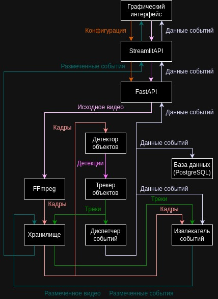

## VideoEventWatcher

### Описание проекта:

Простой API-сервис для отслеживания событий на видеопотоке.

Основан на детекторе YOLOv8, предварительно обученном на датасете Microsoft COCO, и трекере BYTE.
Использует PyTorch для реализации детекции/трекинга и FastAPI для предоставления API.

### Установка:

1. Клонировать репозиторий:  
   `git clone https://github.com/mvp280102/VideoEventWatcher`
2. Перейти в директорию проекта:  
   `cd VideoEventWatcher`
3. Создать и активировать виртуальное окружение:  
   `python -m venv venv`  
   Для Linux/Mac: `source venv/bin/activate`  
   Для Windows: `venv/Scripts/activate.bat`
4. Установить зависимости:  
   `pip install -r requirements.txt`

Для корректной работы сервиса необходим интерпретатор Python версии не ниже 3.8 и сервер СУБД PostgreSQL.
Также рекомендован инструмент администрирования баз данных pgAdmin 4.

### Первый запуск:
1. В СУБД PostgreSQL создать базу данных с названием `videoeventwatcher`.
2. Загрузить веса модели детекции из официального репозитория YOLOv8 (см. раздел Источники).

### Использование:

1. Запустить сервер FastAPI:  
   `uvicorn main:app --reload`  
   Сервер будет доступен по адресу http://127.0.0.1:8000.
2. Запустить приложение Streamlit:  
   `streamlit run gui.py`  
   Приложение будет доступно по адресу http://localhost:8501
3. Задать конфигурацию и запустить отслеживание событий.

### Источники:
* [Веб-фреймворк FastAPI](https://fastapi.tiangolo.com/)
* [Детектор YOLOv8](https://docs.ultralytics.com/models/yolov8/)
* [Трекер BYTE](https://github.com/ifzhang/ByteTrack)
